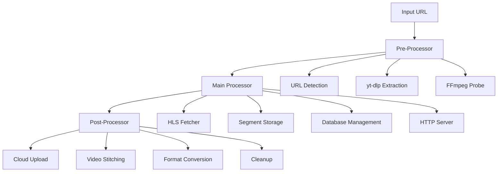

# System Architecture

## 🏗️ Overview

The Video Stream Recorder (VSR) follows a modular pipeline architecture with three main processing phases:



## 📋 Component Architecture

### **Pre-Processor Layer**

**Purpose**: Convert any video source into an HLS stream URL

#### **1. URL Detection Engine**
```go
type URLDetector struct {
    patterns []URLPattern
    timeout  time.Duration
}

type URLPattern struct {
    regex    *regexp.Regexp
    priority int
    handler  ProcessorFunc
}
```

**Responsibilities:**
- Detect input URL type (direct HLS, YouTube, Twitch, etc.)
- Route to appropriate extraction method
- Validate and normalize URLs

#### **2. yt-dlp Integration**
```go
type YTDLPProcessor struct {
    binary   string
    timeout  time.Duration
    quality  string
    format   string
}

type StreamMetadata struct {
    Title      string
    Duration   time.Duration
    Resolution string
    Bitrate    int
    Formats    []FormatInfo
}
```

**Features:**
- Extract HLS URLs from 1000+ supported sites
- Quality selection and format filtering
- Metadata extraction for analytics
- Error handling and retry logic

#### **3. FFmpeg Probe**
```go
type FFmpegProbe struct {
    binary     string
    timeout    time.Duration
    probeDepth int
}
```

**Capabilities:**
- Stream format detection
- Codec analysis
- Bitrate and resolution detection
- Protocol validation

### **Main Processor Layer**

**Purpose**: Core HLS recording and serving functionality

#### **1. HLS Fetcher**
```go
type HLSFetcher struct {
    client      *http.Client
    cache       *FIFOCache
    segments    chan *Segment
    retry       RetryConfig
}

type Segment struct {
    URL      string
    Duration float64
    Sequence int64
    Data     []byte
    Timestamp int64
}
```

**Process Flow:**
1. Fetch M3U8 playlist every 3 seconds
2. Parse new segments using `github.com/grafov/m3u8`
3. Download TS segments concurrently
4. Apply FIFO cache to prevent duplicates
5. Forward to storage layer

#### **2. Storage Management**
```go
type StorageManager struct {
    db       *bbolt.DB
    filesDir string
    retention time.Duration
}

type DatabaseItem struct {
    ID       uint64
    Name     string
    Duration float64
    Timestamp int64
    Size     int64
    Checksum string
}
```

**Storage Strategy:**
- **Files**: Raw TS segments in `./files/` directory
- **Database**: BoltDB for metadata and indexing
- **Naming**: Timestamp-based filenames for chronological ordering
- **Cleanup**: Background worker removes expired content

#### **3. HTTP Server**
```go
type HTTPServer struct {
    router     *mux.Router
    storage    *StorageManager
    templates  *template.Template
}
```

**Endpoints:**
- `GET /live/stream.m3u8` - Live stream (last 5 segments)
- `GET /start/{timestamp}/{duration}/vod.m3u8` - VOD playlist
- `GET /live/{segment}` - Individual segment files
- `GET /health` - Service health check

#### **4. Database Layer**
```go
type Database struct {
    db     *bbolt.DB
    bucket []byte
    mutex  sync.RWMutex
}
```

**Operations:**
- Segment metadata storage
- Time-range queries for VOD
- Retention policy enforcement
- Transaction management

### **Post-Processor Layer (Future)**

**Purpose**: Handle processed content for distribution and archival

#### **1. Cloud Storage Integration**
```go
type CloudUploader struct {
    provider StorageProvider
    bucket   string
    workers  int
    queue    chan UploadJob
}

type StorageProvider interface {
    Upload(key string, data []byte) error
    Delete(key string) error
    Exists(key string) (bool, error)
}
```

**Supported Providers:**
- Amazon S3
- Google Cloud Storage
- Azure Blob Storage
- MinIO

#### **2. Video Stitching**
```go
type VideoStitcher struct {
    ffmpeg   string
    tempDir  string
    formats  []OutputFormat
}

type StitchJob struct {
    StartTime  time.Time
    EndTime    time.Time
    OutputPath string
    Format     string
    Quality    string
}
```

**Capabilities:**
- Combine segments into single files
- Format conversion (MP4, MKV, etc.)
- Quality transcoding
- Thumbnail generation

#### **3. Analytics & Monitoring**
```go
type Analytics struct {
    metrics   *prometheus.Registry
    traces    trace.TracerProvider
    logger    *zap.Logger
}
```

**Metrics:**
- Stream count and health
- Storage usage and growth
- Network bandwidth consumption
- Error rates and patterns

## 🔄 Data Flow

### **Recording Flow**
```
Input URL → Pre-processor → HLS URL → Fetcher → Segments → Storage → Database
                                           ↓
                                    FIFO Cache ← Deduplication
```

### **Playback Flow**
```
HTTP Request → Router → Database Query → Segment List → M3U8 Generation → Response
                            ↓
                     File System → Segment Data → HTTP Response
```

### **Cleanup Flow**
```
Background Worker → Database Scan → Expired Segments → File Deletion → Database Update
```

## 🧩 Component Interactions

### **Concurrent Operations**
1. **Main Goroutine**: HTTP server and request handling
2. **Fetcher Goroutine**: HLS downloading and processing
3. **Cleanup Goroutine**: Retention policy enforcement
4. **Upload Goroutines**: Cloud storage operations (future)

### **Synchronization**
- **Database**: BoltDB transactions for consistency
- **Cache**: Mutex-protected FIFO cache
- **File System**: Atomic write operations
- **HTTP**: Concurrent request handling

### **Error Handling**
- **Network Errors**: Exponential backoff retry
- **Storage Errors**: Graceful degradation
- **Parser Errors**: Skip malformed segments
- **Resource Errors**: Circuit breaker pattern

## 📊 Performance Characteristics

### **Memory Usage**
- **Base Application**: ~50MB
- **Per Stream**: ~10MB (buffering + metadata)
- **Database**: ~1MB per 1000 segments
- **Cache**: ~5MB per stream (10 segments)

### **CPU Utilization**
- **Network I/O**: 60% of CPU time
- **File Operations**: 25% of CPU time
- **Parsing/Processing**: 10% of CPU time
- **HTTP Serving**: 5% of CPU time

### **Storage Requirements**
- **Segments**: ~1GB per hour per stream
- **Database**: ~10MB per hour per stream
- **Logs**: ~100MB per day per stream

## 🔧 Configuration Architecture

### **Startup Configuration**
```go
type Config struct {
    Server    ServerConfig
    Storage   StorageConfig
    Network   NetworkConfig
    Logging   LoggingConfig
}
```

### **Runtime Configuration**
- Hot-reload for non-critical settings
- Environment variable overrides
- Configuration validation
- Default value management

This architecture provides a solid foundation for scalable video stream recording while maintaining simplicity and reliability.
